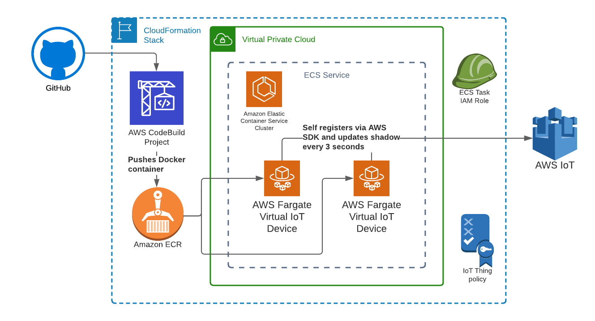

# Getting Started with Fleet Hub

## Overview

This demo uses virtual IoT devices running in ECS Fargate to show you how you can get started with Fleet Hub. The Fargate instances will automatically create certificates, register with IoT Core, and publish their shadow every 3 seconds.
You can then use Fleet Hub to monitor these virtual devices and use IoT Jobs to push jobs to the devices that will simulate firmware updates and cause devices to go offline.

### Architecture Overview

### AWS Services Used
- AWS IoT Core Broker
- AWS IoT Core Registry
- AWS IoT Core Shadow Service
- Amazon Elastic Container Service
- AWS Fargate
- AWS CodeBuild
- Amazon Elastic Container Registry
- AWS Cloudformation

## Difficulty Level
250

## Prerequisites

This demo uses CloudFormation and the AWS IoT Python SDK v1. To create the demo, you only need either AWS console access or the AWS CLI.

Required IAM permissions:
Admin level permissions are required

## Associated Content
Video: https://www.youtube.com/watch?v=SqSS174GTYo&t

## Setup
1) In the AWS IoT console, switch regions to us-east-1 if you're not already there.
2) Click "Manage" in the left sidebar and then "Types" On hte next page that loads, click "Create Thing Type"
3) Under Thing type name enter in "dispenserV1" and click Create thing type.

### Creating your virtual device fleet

1) Enable Fleet Indexing in the region. You can either do that through the "settings" in the IoT Console or through the CLI with this command:
aws iot update-indexing-configuration \
  --thing-indexing-configuration thingIndexingMode=REGISTRY_AND_SHADOW,thingConnectivityIndexingMode=STATUS \
  --thing-group-indexing-configuration thingGroupIndexingMode=ON
2) Launch CloudFormation template iot_dm_cloudformation.json
3) Start a build of the CodeBuild project that was created in the CloudFormation stack. A link to the project can be found in the CloudFormation resources section.
4) Open the ECS Service created from the CloudFormation stack (also shown in the CloudFormation resources) and increase number of tasks to desired count.

You now have virtual devices running and connected to AWS IoT. They are ready to receive Jobs messages and are updating their shadows every 3 seconds. They're also sending heartbeat telemetry messages.

### Fleet Hub setup

1) In the AWS IoT console, switch regions to us-east-1 if you're not already there.
2) Click "Fleet Hub" in the left sidebar and then "Get Started". On the next page that loads to the right, click "Create Application".
3) Because Fleet Hub uses AWS SSO instead of IAM to manage users, you'll be prompted to setup AWS SSO if you haven't already done so.
4) Once AWS SSO setup is done, click "Next" and you'll be taken to the Fleet Indexing setup. Because you already completed this step earlier, simply click "Next".
5) On the "Configure Application" page, you'll be prompted to "Create a new service role", which you'll leave checked. You'll also need to fill in the "Application Name". Then click "Click Application".
6) Your Fleet Hub application is now created. You'll be taken back to the Fleet Hub applications page where you should see your new Fleet Hub application. Now you need to add your AWS SSO user to the application. Click the name of the Fleet Hub application in the list. On the next application detail page, click "Add Users" and select your AWS SSO to be added to the Fleet Hub application.
7) In order to be able to filter and monitor on specific attributes in Fleet Hub, you'll need to set those up as "aggregation fields" in Fleet Indexing. To do that in the IoT Console you'll click "Settings" and then scroll down to "Set custom fields". Use the "Add" button to create the following fields:
    - Field name: "shadow.reported.firmware_version", Field type: Number (In Fleet Hub, fields need to be numbered in order to use comparison operators)
    - Field name: "shadow.reported.battery_state_of_charge", Field type: Number
    - Field name: "shadow.reported.temperature", Field Type: Number
8) You're all done! You can now go back to the Fleet Hub console and click the Application URL listed to launch your Fleet Hub application. Note: It might take a minute for the DNS to propagate. If prompted, make sure to log in with your AWS SSO user credentials.

## Running the demo

### Using Fleet Hub to monitor your fleet

The virtual devices update 3 shadow attributes that can be filtered on in the Fleet Hub application: "firmware_version", "battery_state_of_charge", and "temperature".
The devices also support 2 types of jobs:
 - Mock firmware updates
 - A job called "order_66" that causes devices to randomly misbehave.
Examples of the docs that the devices will accept are in the "job_docs" folder. You will need to configure the S3 bucket and jobs themselves on your own.

## Cleanup

1) Update ECS Service to desired task count of "0"
2) Delete things and certificates in registry (this must be done before policy is deleted by CloudFormation stack delete)
3) Delete CloudFormation stack
